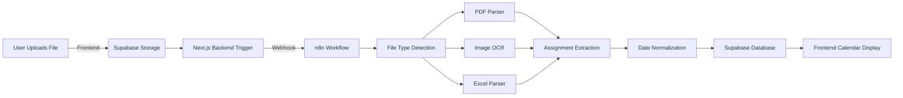

# 📅 Syllabus Parser — AI-Powered Smart Schedule Extractor

This project is an end-to-end intelligent schedule extraction system designed to parse academic syllabi into a fully structured, centralized calendar for students. It handles complex file types, intelligently extracts due dates, optimizes task planning, and integrates with modern databases and AI models.

Built with:

- **Next.js** (Frontend & API)
- **Supabase** (Storage + Database + Auth)
- **n8n** (Workflow Orchestration)
- **OpenAI / GPT** (LLM-powered extraction and classification)

---

## 🔎 Key Features

✅ Multi-format File Uploads

- PDF
- Excel
- Image (JPG, PNG, iPhone Photos)
- Markdown

✅ AI-Powered Parsing

- Uses OCR (Textract, Google Vision)
- NLP-powered extraction for non-standard syllabus formats
- Dynamic recognition of assignment titles, dates, descriptions

✅ Smart Date Normalization

- Week-based schedules automatically converted into actual calendar dates
- Supports custom course start dates

✅ Task Optimization Engine (Planned)

- Prioritization of upcoming deadlines
- Suggests early prep windows based on workload
- Identifies heavy weeks and recommends buffer time

✅ Categorization & Filtering (Planned)

- Separate readings, exams, projects, quizzes
- Expandable views for course-specific tasks
- Tagging system for quick filtering

✅ Unified Calendar (Planned)

- Combines all courses into one master calendar
- Expandable by course, category, priority
- Supports sync with Google Calendar & Notion

✅ Full Automation Pipeline

- No manual parsing needed
- Visual monitoring via n8n dashboard
- Retry mechanisms and error handling

✅ Extensible API Design

- Modular architecture for SaaS-style deployment
- Support for multiple user accounts
- Scalable file ingestion

---

## 🏗 Architecture

---

## 🔧 Tech Stack

| Tech                        | Purpose                                     |
| --------------------------- | ------------------------------------------- |
| **Next.js**                 | Frontend UI & API Routes                    |
| **Supabase**                | File Storage, Authentication, PostgreSQL DB |
| **n8n**                     | No-code Automation for Parsing Workflows    |
| **OpenAI / GPT-4**          | LLM for advanced text extraction            |
| **OCR (Textract / Vision)** | Optical Character Recognition for images    |

---

## 🛠 How It Works

1️⃣ **User uploads syllabus files** (PDF, Image, Excel, Markdown)

2️⃣ **Supabase stores uploaded files**

3️⃣ **Backend triggers n8n workflow** via Webhook

4️⃣ **n8n workflow handles parsing**:

- File type detection
- OCR or PDF parsing
- Assignment extraction
- Week-to-date conversion

5️⃣ **Structured data inserted into Supabase DB**

6️⃣ **Frontend displays full unified calendar**

---

## 🚀 Planned Roadmap

- [x] File uploads with Supabase Storage
- [x] n8n automation pipeline
- [x] Basic PDF parsing
- [ ] Image OCR (Google Vision integration)
- [ ] Excel parsing with sheet detection
- [ ] Markdown parsing
- [ ] OpenAI-powered fallback extraction
- [ ] Dynamic start date entry per course
- [ ] Task optimization engine
- [ ] Task prioritization scoring
- [ ] Heavy week detection & balancing
- [ ] Unified global calendar view
- [ ] Calendar sync (Google, Notion)
- [ ] User notification system (email/SMS reminders)
- [ ] SaaS deployment version

---

## 🤖 Disclaimers

- This project is under active development.
- Accuracy depends on syllabus formatting and file quality.
- AI-powered extraction is experimental for complex formats.

---

## 💡 Vision

> A fully automated, AI-powered academic planner that extracts, organizes, optimizes, and visualizes entire semester schedules in seconds. Built to save students hours of manual planning, reduce missed deadlines, and optimize time management through intelligent workload balancing.

---

## 🔗 Contributions Welcome

If you'd like to contribute, feel free to open pull requests or submit issues.

---

## ⚡ Maintainer

Built and maintained by Anh Huynh.
